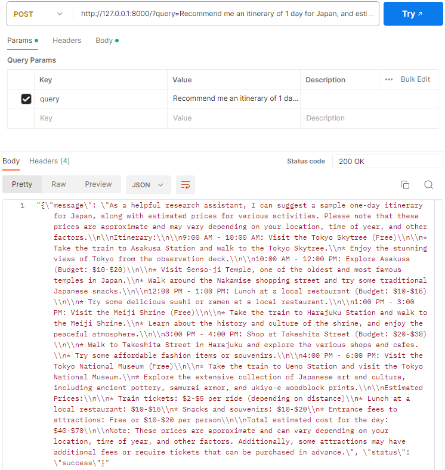
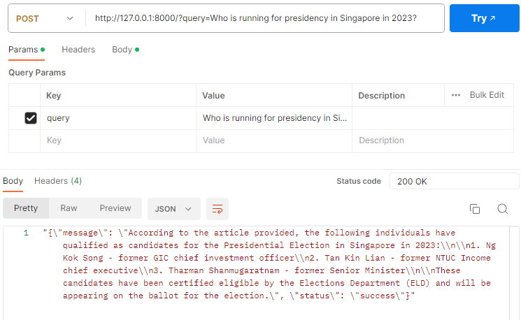

# adapt - Work In Progress!

Llama2 Research Agent hosted locally.

Stack

With the purpose of:

- Keyword Selection &rarr; Querying &rarr; Summarizing &rarr; Refining &rarr; Output :bulb:

## Features

- Built with Llama.cpp and LangChain
- Browserless Loader for scraping.

## Usage/Examples

Planning a trip!:

Getting a summary of current news:

## References

### Tutorials/Guides
todo

### Models
Llama2 7b Chat Quantized [Link](https://huggingface.co/TheBloke/Llama-2-7B-Chat-GGML)

Adapters:

Function Call - 7b &rarr; [Link](http://https://huggingface.co/Trelis/Llama-2-7b-chat-hf-function-calling)
## FAQ

#### Why this project?

One thing that really intrigued me was the agent capabilities of OpenAI GPT4 model.

However, having to pay for the API deterred me since my free API tokens weren't credited :sob:

